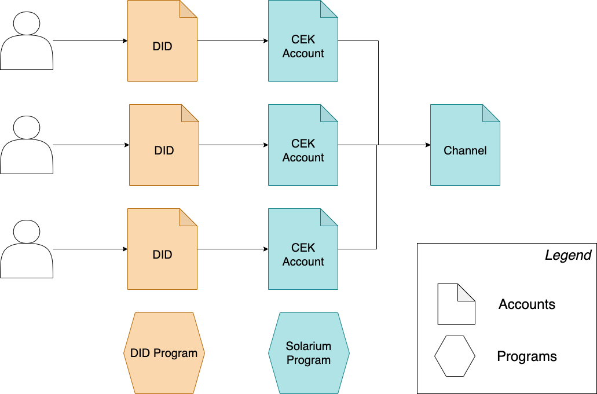
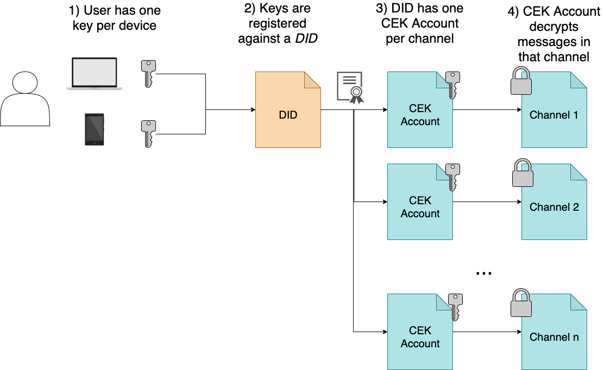

# Solarium

Solarium is a fully decentralised, end-to-end encrypted, censorship-resistant instant messenger
based on the [Solana](https://solana.com) blockchain.

Try it out at http://solarium.chat or install the [cli](https://www.npmjs.com/package/solarium-cli)

## Roadmap

Solarium is currently in alpha phase, running on the Solana devnet.

- Q3 2021 upgrade to Signal Protocol
- Q3 2021 beta release Solana Mainnet
- Q4 2021 mobile app
- Q4 2021 multimedia support

## Getting started

To contribute to Solarium, please check out the [code of conduct](./CODE_OF_CONDUCT.md).

### Program

To build the Rust Solana program, please ensure you first have the Solana tool suite
installed locally by following the steps [here](https://docs.solana.com/cli/install-solana-cli-tools).

Once Rust and Solana are installed, build using:
```sh
cd program
cargo build-bpf
```

Run the program functional tests using:
```sh
cargo test-bpf
```

### Client

The Solarium-JS client is an SDK that can be used to integrate browser and NodeJS applications
with Solarium, and is available on [NPM].

To build and test the client locally,

1. Install [NVM](https://github.com/nvm-sh/nvm#installing-and-updating) and [Yarn](https://yarnpkg.com/)
2. Update node:
```sh
nvm install
```
3. Install the dependencies
```
cd client
yarn
```
4. Build using:
```sh
yarn build
```
5. To run end-to-end tests,
   you must first compile the solarium Rust program (see [Program](#program) above)
   
In one shell, run:
```sh
yarn start-validator
```

In another shell
```sh
yarn test
```

### CLI

The [Solarium CLI](https://www.npmjs.com/package/solarium-cli) is a command-line instant messenger using NodeJS.
To install it:

```sh
yarn global add solarium-cli
solarium --help
```

The CLI does not require the Solana tool suite to be installed locally.

If Solana is not installed locally, a new private key will be generated the first time
Solarium is used, and it will be stored in `$HOME/.solarium`.

If Solana is installed locally, the default Solana wallet, stored at `$HOME/.config/solana/id.json`
will be used for signing and encrypting transactions.

To build the CLI locally, install nvm and yarn as [above](#client), then run:

```sh
cd cli
yarn
yarn build
```

By default, the CLI runs against the devnet chain.

### Browser UI

The browser UI, available at https://solarium.chat, is hosted on IPFS and pinned by Infura.

To run it locally, install nvm and yarn as [above](#client), then run:

```sh
cd ui
yarn
yarn start
```

By default, the browser UI runs against the devnet chain.

## Technical Details



Solarium is based on two important concepts: _Identities_ and _Channels_.
Both are represented as [Accounts](https://docs.solana.com/terminology#account) on the Solana blockchain.

### Identity

An _Identity_ is your personal avatar on-chain.
You can associate this identity with multiple keys.
Any key registered against your identity can access your messages and send messages on your behalf.
This is the cornerstone for multi-device support in Solarium, and allows for key recovery and custody.

Identities in solarium use the [W3C Decentralized Identity (DID) standard](https://www.w3.org/TR/did-core/).
They are therefore fully standardised and portable, and usable outside of Solarium.



### Channels

A _Channel_ is an encrypted store of messages between two or more users.
There are two types of channel:
- _Group Channels_ have any number of members and are referenced by name and address. 
  Users are invited to group channels by other members.
- _Direct Channels_ have two members only.
  Their address is derived from the identities of the members using
  [program-derived addresses (PDAs)](https://docs.solana.com/developing/programming-model/calling-between-programs#program-derived-addresses).
  
Group channels can be public (with a known _inviter authority_) or private (invite-only).

### Security

#### E2E encryption

All messages in Solarium are end-to-end encrypted using
the [XChaCha20-Poly1305](https://datatracker.ietf.org/doc/html/draft-irtf-cfrg-xchacha-01)
symmetric encryption algorithm, using a 256-bit content encryption key (CEK)
that is shared for all messages in a given channel.

Note: The use of the same CEK for all messages in a channel means that Solarium
does not at present exhibit [perfect forward secrecy (PFS)](https://en.wikipedia.org/wiki/Forward_secrecy). 
Future implementations of Solarium (see [the roadmap](#roadmap)) above will move to
the [Signal Protocol](https://signal.org/docs/) to support PFS.

The CEK is then encrypted for each member of a channel using the
ECDH-ES+XC20PKW algorithm (a CEK-wrapping variant of the 
[Elliptic Curve Diffie-Hellman](https://datatracker.ietf.org/doc/html/rfc6278)
algorithm). The CEK is encrypted for each key in the user's [DID](#identity).

The set of encrypted CEKs are then stored on-chain in a _CEK Account_ for the user.
The user therefore has one CEK Account for each channel that they are
a member of. CEK Account addresses are derived from the user's DID and the
channel address using
[program-derived addresses (PDAs)](https://docs.solana.com/developing/programming-model/calling-between-programs#program-derived-addresses).

This has the benefit that only one address (the channel address) needs to be
known, in order to send or receive messages, rather than two
(the channel and CEK account). However, it has a significant downside:
It is possible to discover if a user is a member of a group if you know their
DID address and the channel address. Future versions will mitigate this
by storing the association between a channel and a CEK account in an 
encrypted on-chain address book instead of using PDAs.

#### Message signing and repudiability

The above section discusses message encryption and decryption but does
not discuss message signing, i.e. proof of provenance of a message.

The message content in Solarium is not directly signed, i.e. the data itself,
once decrypted, does not contain details about the sender. Instead, the 
blockchain transaction that adds the message to the channel is signed by the
sender. The Solarium program ensures the following statements are true:
1. The sender key of the transaction currently belongs to the DID of the stated sender of the message
2. The sender DID is a member of the channel that the message is being posted to.

## Frequently Asked Questions (FAQs)

### What is Solarium?
Solarium is a fully decentralised, end-to-end encrypted, censorship-resistant instant messenger
based on the [Solana](https://solana.com) blockchain.

### Why did you create Solarium?
We believe that a completely decentralized censorship-resistant messaging solution on a blockchain
is a missing link to establishing fully-decentralized trusted communities. For example, current implementations 
of DEXs and DAOs generally rely on a third-party off-chain communication tools (e.g. Discord, Slack, ...) that break the
chain of trust between an on-chain identity and communication platform.

We also believe in [Decentralized Identifiers (DIDs)](https://www.w3.org/TR/did-core/) as the basis of
new internet identity layer that would allow to build these communities from the group up.

### How secure is Solarium?
All messages in Solarium are end-to-end encrypted using
the [XChaCha20-Poly1305](https://datatracker.ietf.org/doc/html/draft-irtf-cfrg-xchacha-01)
symmetric encryption algorithm, using a 256-bit content encryption key (CEK)
that is shared for all messages in a given channel.

The CEK is then encrypted for each member of a channel using the
ECDH-ES+XC20PKW algorithm (a CEK-wrapping variant of the
[Elliptic Curve Diffie-Hellman](https://datatracker.ietf.org/doc/html/rfc6278)
algorithm). The CEK is encrypted for each key in the user's [DID](#identity).

The use of the same CEK for all messages in a channel means that Solarium
does not at present exhibit [perfect forward secrecy (PFS)](https://en.wikipedia.org/wiki/Forward_secrecy).
Future implementations of Solarium (see [the roadmap](#roadmap)) above will move to
the [Signal Protocol](https://signal.org/docs/) to support PFS.

### How decentralized is Solarium?
The solarium frontend only requires a [JSON RPC API](https://solana-labs.github.io/solana-web3.js/) to Solana and
a Wallet (currently [SPL Token Wallet](https://github.com/project-serum/spl-token-wallet)). The [Solarium frontend](https://solarium.chat/) is 
currently hosted on IPFS and served via [Infura](https://infura.io/docs/ipfs).

### How many messages can be persisted within a channel (direct or group)?
Currently, there is a hard-coded on-chain limit of 8 messages that can be persisted per channel. Newer messages will
automatically overwrite older ones.

### How to I send a new message
When in a direct or group channel, just type your message in the message box and hit **RETURN**. This will trigger
a transaction within the wallet to send the encrypted message to the current channel.

### How do add an alias for a participant (represented by a DID)?
Unknown users are represented by their DID within the lobby. You can add an alias by clicking the

icon, either within a channel (e.g. the lobby), or next to the **Contacts** heading.

### How do I create a direct channel with a user?
Direct channels are automatically generated when a Contact alias is added for a DID. Please note that it's necessary for 
**both** parties to add each other as a contact alias in order to have a bidirectional conversation 

### I've created a direct chat, but the other party is not able to see it.
It's necessary for **both** parties to add each other as a contact alias in order to have a bidirectional conversation.

### How do I create a group channel?
You can create a new group channel by clicking the

icon next to the **Channels** heading. The resulting
modal will ask for a channel-name. Please note, that the channel-name is persisted on chain and cannot be changed later.


### I've created a group channel, how can I invite others to it?
New channels have the creater as the sole member. The invitation is a two-step process:
1. Invite an existing contact alias to your channel by clicking the 
   
   icon next to a group channel and selecting the alias to invite. 
   Please note, inviting a member twice will result in an error message being shown.

2. Sending an invite link to the newly invited alias: Clicking the
   
   icon next to a group-channel will copy a universal invite link for the given channel, which will need to be shared 
   with the invited user. Clicking the invite link will add the channel to the **Channels** list of the invitee. 
   **Note**: The invite link will **ONLY** work for users that were previously invited by performing step 1. 
   It will have no effect for everyone else.


### I've invited a contact to my group channel, but he cannot find it. What's going on?
After inviting an alias to a group channel you'll need to share the group-link with the new member. See
"I've created a group channel, how can I invite others to it?". step 2.


### Can I use Solarium on Mainnet?
The current version of Solarium is in Alpha-Phase and works against the [Solana Devnet](https://docs.solana.com/clusters#devnet). 
This allows for an easy onboarding experience, including an automatic airdrop of SOL. An Beta-Release on Mainnet is 
planned shortly according to our roadmap.

### Will there be a mobile App for Solarium?
We plan to release an Solarium Mobile App at the end of the year.


